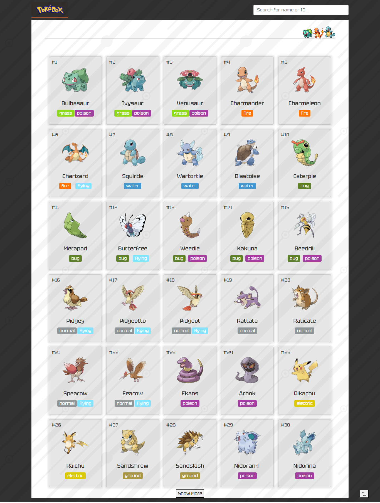
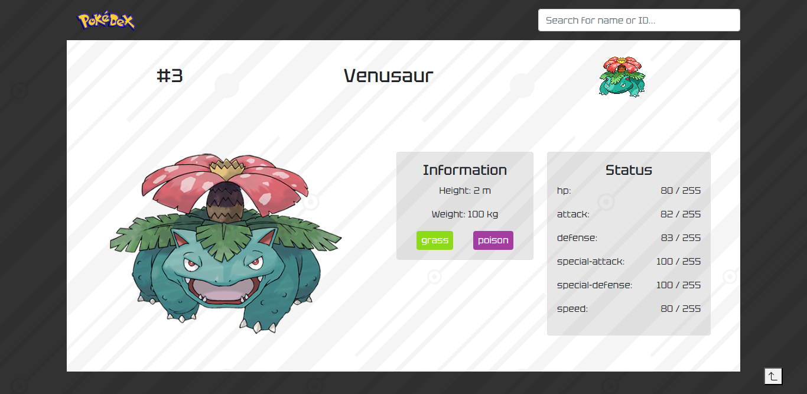
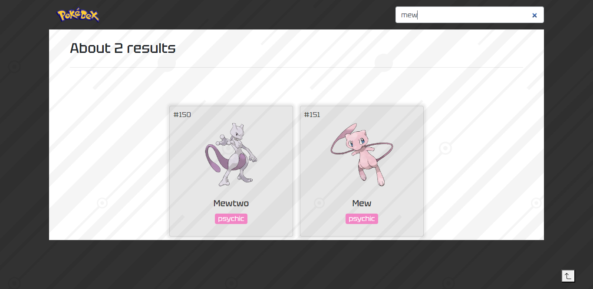
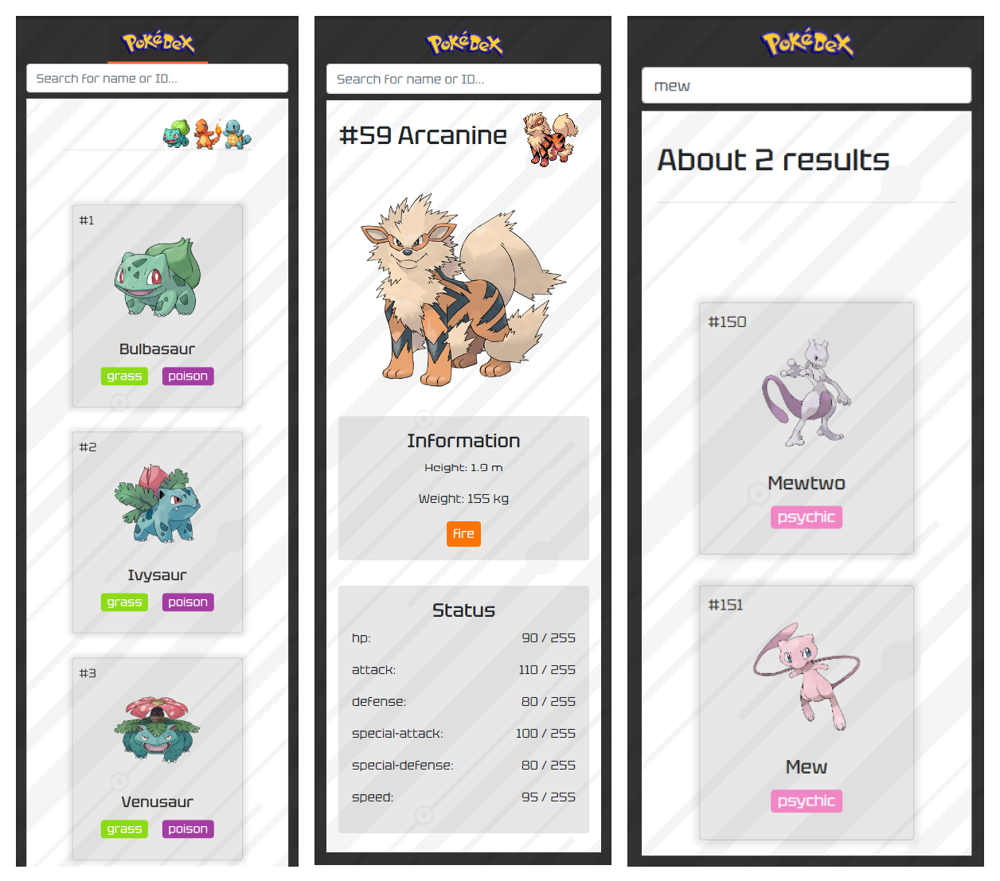

Bem-vindo a Pokedex, um aplicativo para entusiastas que desejam explorar o mundo Pokémon. Com uma interface intuitiva e amigável, a Pokedex oferece uma extensa base de dados com informações detalhadas sobre todos os Pokémon conhecidos, desde os clássicos até os mais raros. Você poderá descobrir informações e curiosidades de cada criatura. Além disso, nosso sistema de busca avançada permite filtrar os Pokémons com base em nome e ID.

Projeto de autoria própria, com desing e features inspirados em outras aplicações já existentes. Desenvolvido com TypeScript, React e Bootstrap. E esse foi o meu resultado final 💻<https://pokedex-eta-olive.vercel.app/>.









</br>

## 🎯 Objetivos

Os usuários devem ser capazes de:

> - Ver o layout ideal para a interface de acordo com o tamanho de tela do seu dispositivo
> - Ver os estados de "hover" e "focus" para todos os elementos interativos na página
> - Navegar por uma lista de todos os Pokémons
> - Clicar no Pokemon e ter informações de cada criatura
> - Pesquisar por nome ou ID

</br>

## 🔧 Propriedades e Tecnologias

> - Vite
> - TypeScript
> - React
> - React Router DOM v6
> - React icons
> - PokeAPI
> - Bootstrap 4
> - SASS
> - Mobile-first
> - Semântica HTML

</br>

## 🧠 Meu aprendizado

> - TypeScript

TypeScript é uma linguagem que adiciona tipos ao JavaScript. Ele nos permite escrever JavaScript, mas adicionando tipos, que pode detectar possíveis bugs, esclarecer a estrutura e ajudar a refatorar nosso código. 


<!-- React.ts
```js
...
import { useForm } from 'react-hook-form';
import { yupResolver } from '@hookform/resolvers/yup';
import { object, string } from 'yup';
...
const {
  register,
  handleSubmit: onSubmit,
  formState: { errors },
} = useForm({ resolver: yupResolver(schema) })
...
...
<input
  {...register('name')} 
  id='name'
  type='text'
  placeholder='e.g. Stephen King'
/>
...
```

Acima estão seus componentes básicos, onde "register" é responsável por registrar a propriedade "name" de cada input, para assim termos o controle.

```js
...
const handleSubmit = () => {
  navigate("/select-plan")
}
...
<form onSubmit={onSubmit(handleSubmit)}>...
...
```

"handleSubmit: onSubmit", é uma função que recebe outra função como argumento, responsável pelo controle do submit do formulário. Aqui reatribuímos ela a "onSubmit", para não entrar em conflito com nossa função de mesmo nome, já existente.

```js
...
<input className={errors?.name?.message ? 'w-100 p-1 px-2 border border-danger rounded' : 'w-100 border rounded p-1 px-2'}
  id='name'
  type='text'
  placeholder='e.g. Stephen King'
  {...register('name')}
/>
...
```

"formState: { errors }", formState guarda o estado de todos os elementos registrados e dele, através da atribuição desestruturada, podemos extrair os erros, para assim como no exemplo acima, renderizarmos na página.

```js
...
const schema = object({
  name: string().required("This field is required"),
  email: string().required("This field is required"),
  phone: string().required("This field is required"),
})
...
```

"useForm({ resolver: yupResolver(schema) })", a própria biblioteca recomenda outra biblioteca chamada Yup, para estruturar a base de dados do formulário, como um objeto, chamado de "schema". Assim a validação fica mais intuitiva.

[saiba mais!](https://react-hook-form.com/get-started)

</br> -->

## 💻 Rodando o projeto

Para conferir a versão final é só acessar o link: 💻<https://pokedex-eta-olive.vercel.app/>.

</br>

## Autor

- LinkedIn - [Pedro A. Lima](https://www.linkedin.com/in/pedroalima6/)